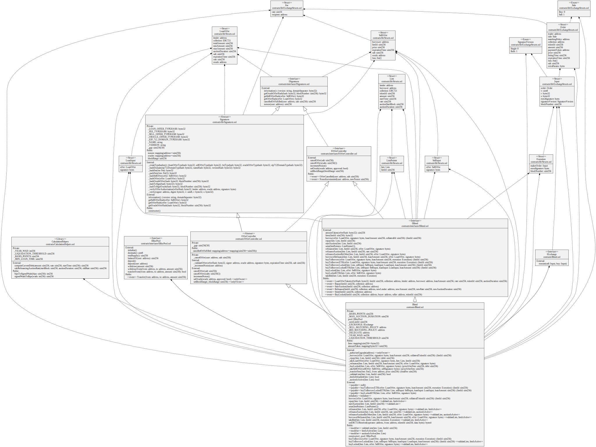

# blend-analysis

几天前 Blur 推出了 Blend：NFT 的点对点永久借贷协议（the Peer-to-Peer Perpetual Lending Protocol for NFTs）。该协议是 Blur 与 [@Paradigm](https://twitter.com/paradigm) 的 [@danrobinson](https://twitter.com/danrobinson) 和 [@transmissions11](https://twitter.com/transmissions11) 合作的产物。 danrobinson 是 Uniswap V3 的发明者之一。transmissions11 则是 Paradigm 的研究员，也是 Seaport 的主要贡献者。

这个链接是白皮书的地址。
https://www.paradigm.xyz/2023/05/blend

Blend 有以下几个特点：

1. No Oracles（无需预言机）：利率和贷款价值比率由贷款人决定，让市场来调节。
2. No Expiries（无到期日）：生成的借贷没有到期时间，只要有贷款人愿意用抵押品贷款，贷款就一直有效。只有在利率变化或其中一方想退出头寸时，才需要进行链上交易。
3. Liquidatable（可清算性）：只要贷款人触发了再融资拍卖，如果没有人愿意以任何利率接手债务，NFT就可能被清算。
4. Peer-To-Peer（点对点）：Blend 采用点对点的模式，每笔贷款都是单独匹配的。

https://twitter.com/mindaoyang/status/1653666517870067712
https://twitter.com/anymose96/status/1653965719904845824
https://twitter.com/0xJamesXXX/status/1653064449887174659
https://twitter.com/qiaoyunzi1/status/1654387280398909440
https://twitter.com/anymose96/status/1653213709056233475

借款人

borrow
借款

repay
还款

borrowerRefinance
在拍卖阶段，借款人重新借款，然后偿还之前的借款
使用场景是：当前有一个新的 loanoffer，借款人接受这个 loanoffer，生成新的贷款，然后用新的出借人的资金偿还之前的借款。

takeBid
接受锁定 NFT 的出价，并使用资金偿还贷款
使用场景：当前有一个对质押 NFT 的出价。借款人接受这个出价，卖出 NFT，然后使用资金偿还贷款。

出借人

startAuction
开始拍卖抵押物所有权，设置 lien 中的 auctionStartBlock: block.number,  auctionDuration: lien.auctionDuration

seize
没收违约的抵押品。判定违约的条件是：借款人没有在拍卖结束之前的时间内偿还贷款。

refinance
重新融资，接受新的 loanoffer，用新贷款的出借人的资金偿还之前借款人的贷款。

新的出借人

refinanceAuction
拍卖中重新融资，偿还之前的贷款，根据当前债务生成新的借贷。新的贷款利率根据之前利率和拍卖时间计算，新的贷款金额为之前贷款的利息和本金之和。
使用场景：新的出借人接受清算中的贷款。用新的出借人的资金偿还之前借款人的贷款。

第三方

refinanceAuctionByOther
拍卖中重新融资，偿还之前的贷款，根据新的金额生成新的借贷。新的贷款利率根据之前利率和拍卖时间计算，新的贷款金额为新的金额。
使用场景：当前有一个新的出借人发出的 loanoffer，可以由第三方撮合该出价。新的出借人接受清算中的贷款。用新的出借人的资金偿还之前借款人的贷款。

买家

buyToBorrow 0x8593d5fc
buyToBorrowETH 0x3ed7d74d
购买 NFT 并与正在拍卖的贷款出价撮合，生成新的借款
使用场景是：当前有一个 loanoffer，但是没有 NFT 与之撮合，买家从交易所中购买 NFT 并与之撮合，生成新的借款，买家成为借款人并获得资金。

https://etherscan.io/address/0x29469395eaf6f95920e59f858042f0e28d98a20b?method=0x8593d5fc
https://etherscan.io/address/0x29469395eaf6f95920e59f858042f0e28d98a20b?method=0x3ed7d74d

https://dashboard.tenderly.co/tx/mainnet/0x6b08a227ce9042fb36ae12e0c0fd81ded630c86dcc33851219f529bacce6f311/logs

buyToBorrowLocked 0x2e2fb18b
buyToBorrowLockedETH 0xb2a0bb86
购买被抵押的 NFT，还清贷款，然后与指定的贷款出价撮合，生成新的借款
使用场景是：当前有一个 selloffer，和一个 loanoffer。买家接受 selloffer，购买 NFT，替之前的借款人还清贷款，接着与 loanoffer 撮合，生成新的借款，买家成为借款人获得资金。

https://etherscan.io/address/0x29469395eaf6f95920e59f858042f0e28d98a20b?method=0x2e2fb18b
https://etherscan.io/address/0x29469395eaf6f95920e59f858042f0e28d98a20b?method=0xb2a0bb86

buyLocked 0xe7efc178
buyLockedETH 0x8553b234
购买被抵押的 NFT，替借款人还清贷款
使用场景是：当前有一个 selloffer，买家接受 selloffer，购买 NFT。然后替借款人还清贷款。

https://etherscan.io/address/0x29469395eaf6f95920e59f858042f0e28d98a20b?method=0xe7efc178
https://etherscan.io/address/0x29469395eaf6f95920e59f858042f0e28d98a20b?method=0x8553b234